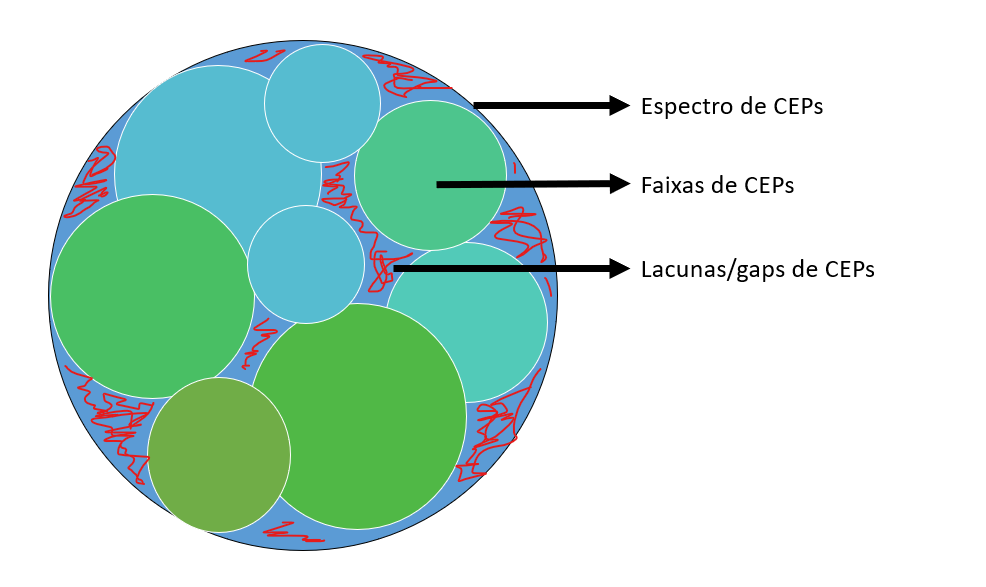

# CEP Gap Finder

O projeto **CEP Gap Finder** é uma ferramenta Python desenvolvida para ajudar a identificar lacunas em faixas de CEPs (Códigos de Endereçamento Postal).

## Descrição

Quando trabalhamos com grandes conjuntos de CEPs, é comum querer identificar quaisquer lacunas ou intervalos vazios nas faixas de CEPs. Isso pode ser útil para garantir que não haja problemas no registro de endereços, otimizar a logística ou para análise de dados geográficos. O **CEP Gap Finder** é uma solução simples e eficiente para essa tarefa.

Drigrama simplificado:



## Recursos

- Identificação de lacunas em faixas de CEPs.
- Processamento rápido de grandes conjuntos de dados.
- Interface de linha de comando para facilidade de uso.
- Saída com as regiões de cada lacuna encontrada.


## Pré-requisitos

- Python 3.x instalado
- Bibliotecas: SQLite3, Pandas e NumPy.

## Como Usar

1. Certifique-se de ter o Python instalado (versão 3.11 ou superior).

2. Clone este repositório para o seu sistema:

   ```bash
   git clone https://github.com/marcos-lopess/cep-gap-finder.git

3. Preencha o arquivo **intervalos_ceps.csv** com os intervalos de CEPs que você tem. Mantenha o nome das colunas como esta no arquivo.

4. Execute o arquivo **main.py**. Ele irá procurar lacunas no dentro do espectro de CEPs informado. 

## Configurações
Por padrão, será procurado lacunas dentro do espectro de CEPs do Brasil, que começa em 1000000 e vai até 99999999.
Para mudar alguns paramentros, faça as alterações no arquivo **config.py**

#### Espectro automatico do CSV 

- Caso queira usar os valores do csv como minino e maximo do espectro de CEP, usando o menor valor da coluna **cep_inicial** e o maior valor da coluna **cep_final**, altere o valor da contante **AUTOMATICO_CSV** para **True**. 

#### Diminuir e alterar espectro de CEPs
- Caso queira especifica o valor de início e fim do espectro de CEPs, alterando os valores de **CEP_INICIAL e CEP_FINAL**, mantendo **AUTOMATICO_CSV** como **False** no arquivo **config.py**


## Licença

Este projeto está disponibilizado sob a Licença MIT. Consulte o arquivo [LICENSE](LICENSE) para obter mais detalhes.